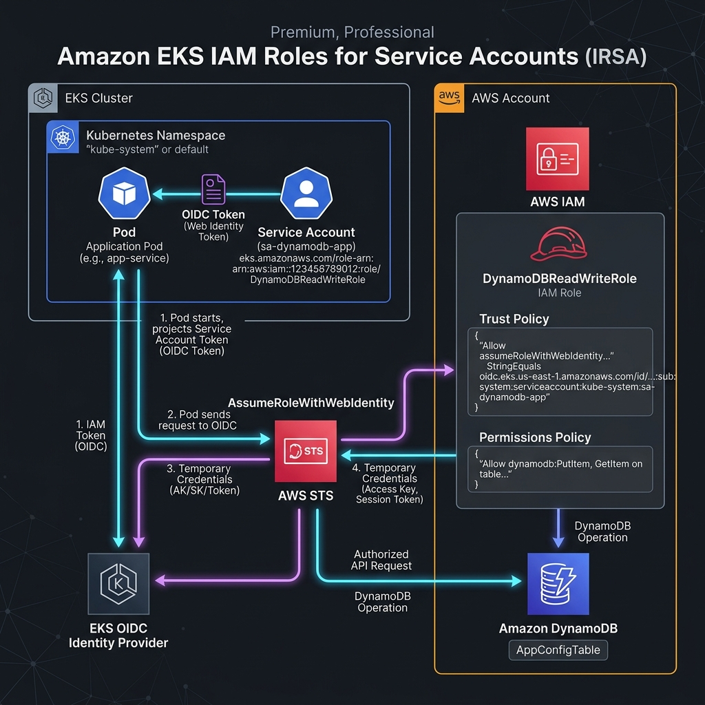
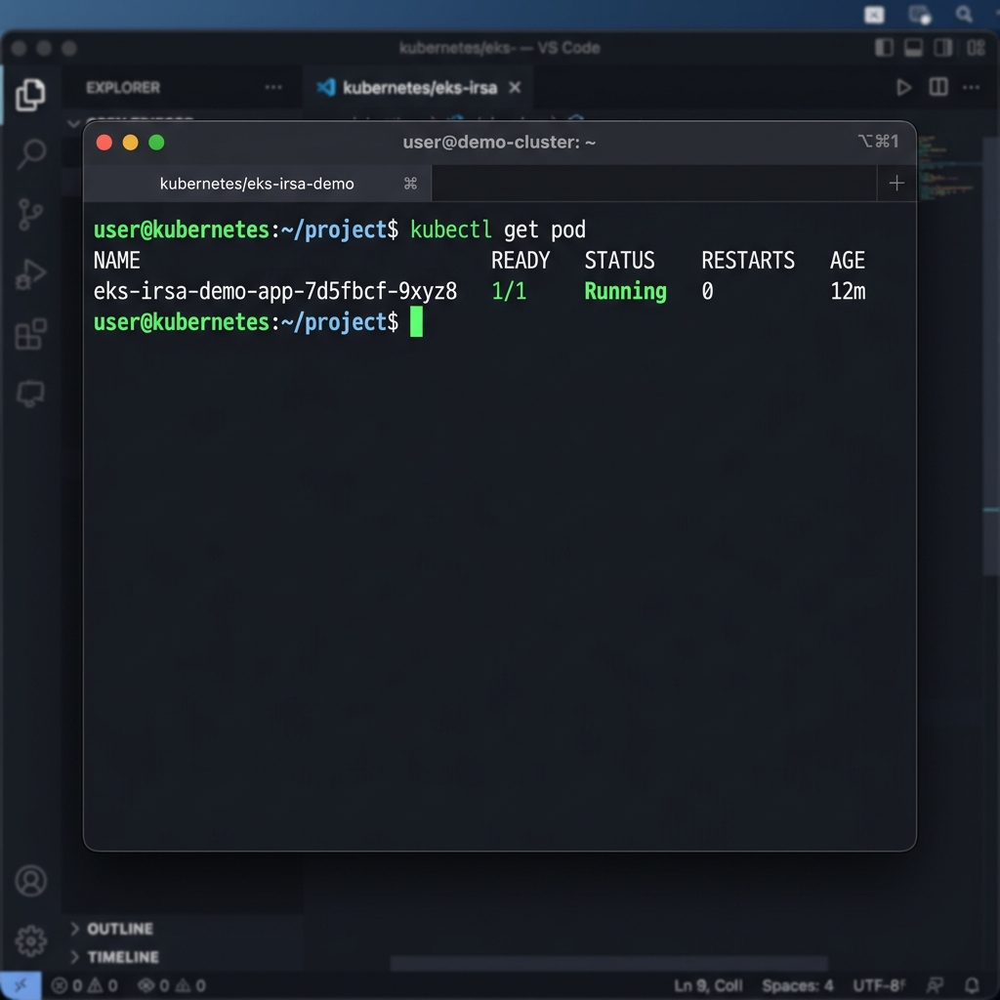
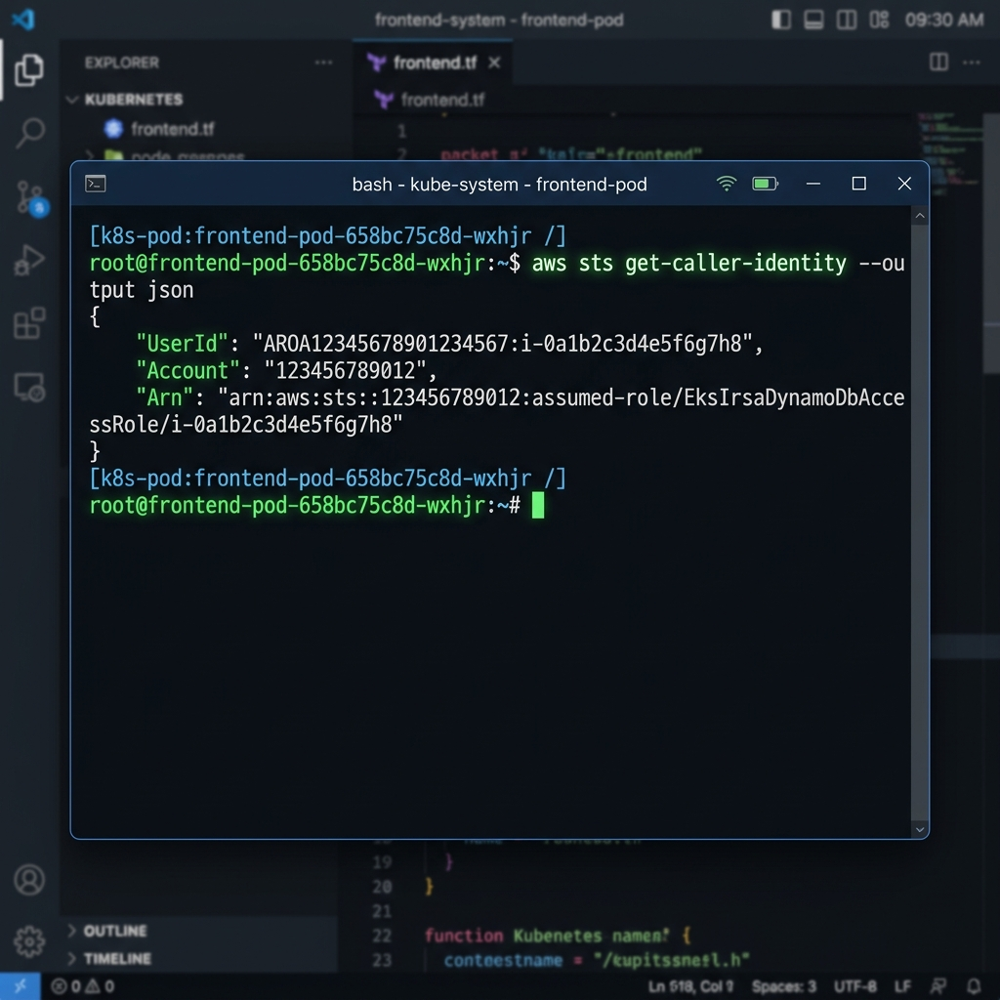
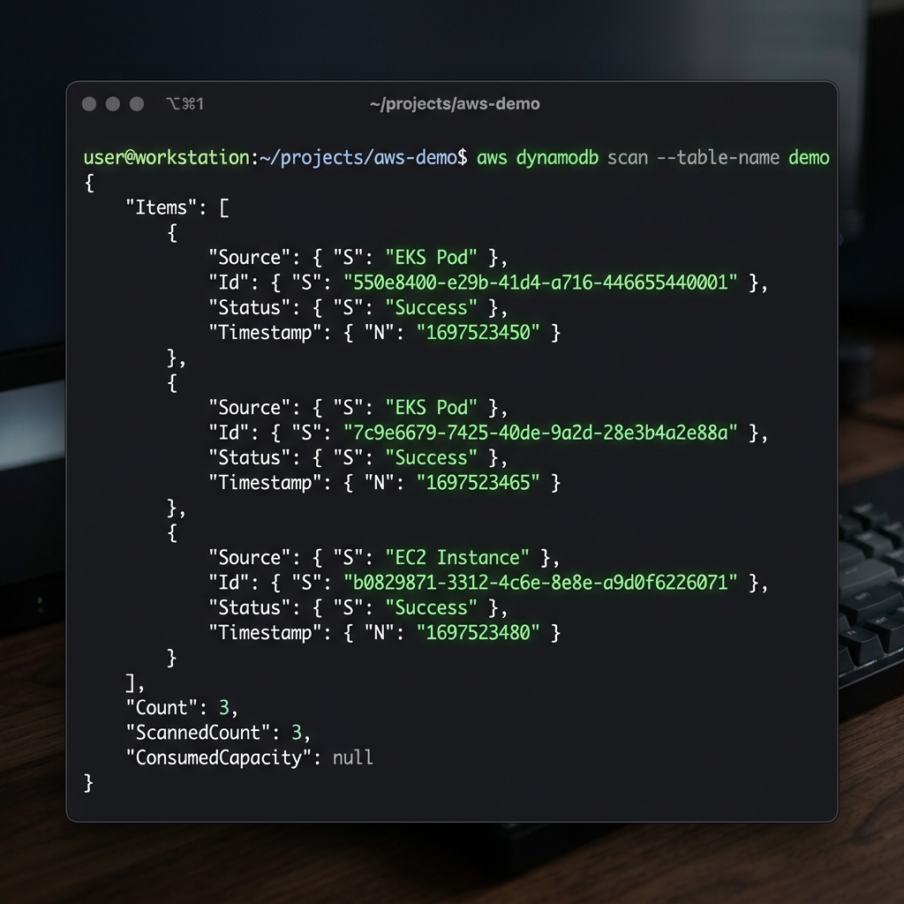

# Implement IRSA (IAM Roles for Service Accounts) for Application Access in Amazon EKS

Secure your Kubernetes applications running inside Amazon EKS by integrating them with AWS Identity and Access Management (IAM). This project demonstrates how to configure pod-level, least-privilege security using **IAM Roles for Service Accounts (IRSA)**, ensuring your applications access Amazon DynamoDB securely without hardcoded AWS access keys.

---

## 🏗️ Architecture Flow



1. **Deployment**: Manifests (`deployment.yaml` and `serviceaccount.yaml`) are deployed to EKS.
2. **Pod Admission**: EKS Pod Identity Webhook intercepts pod creation, reading the ServiceAccount annotation.
3. **Token Injection**: The webhook mounts a projected service account token volume (OIDC token) and injects AWS environment variables (`AWS_ROLE_ARN` and `AWS_WEB_IDENTITY_TOKEN_FILE`) into the pod containers.
4. **Authentication**: The AWS SDK (Boto3) reads the injected token and calls `sts:AssumeRoleWithWebIdentity` to exchange it for temporary AWS credentials.
5. **Authorization**: IAM validates the token signature against the EKS OIDC Provider using trust relationship configurations.
6. **Access**: The pod is granted temporary access credentials to execute read/write operations against the DynamoDB table.

---

## 📖 Key Concepts

### What is OIDC (OpenID Connect)?
OpenID Connect (OIDC) is an identity layer built on top of the OAuth 2.0 protocol. It allows clients to verify the identity of users or systems based on authentication performed by an Authorization Server. In EKS, the cluster acts as an OIDC identity provider, signing JWT tokens representing Kubernetes service accounts.

### Why does IRSA require OIDC?
Historically, pods required AWS credentials either via node instance profiles (violating least-privilege) or hardcoded access keys (violating security hygiene). 

IRSA requires OIDC to act as the bridge between Kubernetes and AWS IAM:
- EKS issues a signed OIDC JSON Web Token (JWT) to the pod.
- AWS IAM trusts the EKS OIDC provider.
- By verifying the EKS OIDC signature, IAM safely permits EKS pods to assume specific roles.

---

## 🛠️ Step-by-Step Implementation Guide

### 1. Prerequisites
Before beginning, ensure you have:
* An active **Amazon EKS cluster** running.
* **kubectl** configured locally (`kubectl config current-context`).
* **AWS CLI** configured with administrator permissions.
* **eksctl** installed on your workstation.

---

### 2. Configure EKS OIDC Provider

To support IRSA, your EKS cluster must have an IAM OIDC provider associated with it.

#### Step 2.1: Retrieve the OIDC Issuer URL
```bash
# Set your cluster name and region
export CLUSTER_NAME="my-eks-cluster"
export AWS_REGION="us-east-1"

# Query the cluster's OIDC issuer
aws eks describe-cluster \
  --name $CLUSTER_NAME \
  --region $AWS_REGION \
  --query "cluster.identity.oidc.issuer" \
  --output text
```
*Example output:* `https://oidc.eks.us-east-1.amazonaws.com/id/EXAMPLED539D4633E53DE1B716D7AF1A`

#### Step 2.2: Associate IAM OIDC Provider
Use `eksctl` to create and associate the IAM OIDC provider:
```bash
eksctl associate iam oidc provider \
  --cluster $CLUSTER_NAME \
  --region $AWS_REGION \
  --approve
```

#### Step 2.3: Verify OIDC Association
List your account's providers to confirm association:
```bash
aws iam list-open-id-connect-providers | grep $(aws eks describe-cluster --name $CLUSTER_NAME --query "cluster.identity.oidc.issuer" --output text | cut -d '/' -f 5)
```

---

### 3. Create the AWS DynamoDB Table

Define and provision the table that our application will write to.

#### Step 3.1: Create Table
We will create a table named `demo`:
```bash
aws dynamodb create-table \
  --cli-input-json file://dynamodb-table.json \
  --region $AWS_REGION
```

#### Step 3.2: Verify Table Creation & Status
```bash
aws dynamodb describe-table \
  --table-name demo \
  --query "Table.TableStatus"
```
Ensure it returns `"ACTIVE"`.

#### Step 3.3: Insert Sample Record
```bash
aws dynamodb put-item \
  --table-name demo \
  --item '{
    "Id": {"S": "setup-1"},
    "Source": {"S": "AWS CLI Initializer"},
    "Status": {"S": "Active"},
    "Timestamp": {"S": "2026-06-25T12:00:00Z"}
  }'
```

---

### 4. IAM Permissions Configuration

Create the IAM Policy allowing DynamoDB access, and create the IAM Role trusted by the EKS OIDC provider.

#### Step 4.1: Retrieve Account Details
```bash
export AWS_ACCOUNT_ID=$(aws sts get-caller-identity --query "Account" --output text)
export OIDC_PROVIDER=$(aws eks describe-cluster --name $CLUSTER_NAME --query "cluster.identity.oidc.issuer" --output text | sed 's/https:\/\///')
```

#### Step 4.2: Create the DynamoDB Access Policy
Create the IAM policy defined in `iam-policy.json`:
```bash
aws iam create-policy \
  --policy-name EksIrsaDynamoDbAccessPolicy \
  --policy-document file://iam-policy.json
```
Make note of the returned Policy ARN: `arn:aws:iam::$AWS_ACCOUNT_ID:policy/EksIrsaDynamoDbAccessPolicy`.

#### Step 4.3: Prepare the Trust Relationship Policy
Configure `trust-policy.json` using your environment variables. Ensure the trust is associated with `irsa-sa`:
```bash
# Create concrete trust-policy.json from template
cat <<EOF > trust-policy-resolved.json
{
  "Version": "2012-10-17",
  "Statement": [
    {
      "Effect": "Allow",
      "Principal": {
        "Federated": "arn:aws:iam::${AWS_ACCOUNT_ID}:oidc-provider/${OIDC_PROVIDER}"
      },
      "Action": "sts:AssumeRoleWithWebIdentity",
      "Condition": {
        "StringEquals": {
          "${OIDC_PROVIDER}:sub": "system:serviceaccount:default:irsa-sa",
          "${OIDC_PROVIDER}:aud": "sts.amazonaws.com"
        }
      }
    }
  ]
}
EOF
```

#### Step 4.4: Create the IAM Role
```bash
aws iam create-role \
  --role-name EksIrsaDynamoDbAccessRole \
  --assume-role-policy-document file://trust-policy-resolved.json
```

#### Step 4.5: Attach Policy to Role
```bash
aws iam attach-role-policy \
  --role-name EksIrsaDynamoDbAccessRole \
  --policy-arn arn:aws:iam::${AWS_ACCOUNT_ID}:policy/EksIrsaDynamoDbAccessPolicy
```

---

### 5. Deploy Kubernetes Configuration

#### Step 5.1: Configure the Service Account
Open `serviceaccount.yaml` and update the role ARN with your AWS Account ID:
```yaml
# serviceaccount.yaml
annotations:
  eks.amazonaws.com/role-arn: arn:aws:iam::<AWS_ACCOUNT_ID>:role/EksIrsaDynamoDbAccessRole
```
Apply the manifest:
```bash
kubectl apply -f serviceaccount.yaml
```

#### Step 5.2: Deploy the Application
Deploy `deployment.yaml` (which encapsulates both the ConfigMap holding our `app.py` script and the Python Pod deployment):
```bash
kubectl apply -f deployment.yaml
```

---

## 🔍 Validation

To verify the setup, run the following diagnostic commands:

#### Step 1: Verify Kubernetes Service Account configuration
Confirm the ServiceAccount is created:
```bash
kubectl get sa
```
Now, verify the annotation `eks.amazonaws.com/role-arn` matches your IAM Role ARN exactly:
```bash
kubectl describe sa irsa-sa
```
*Expected annotation:* `eks.amazonaws.com/role-arn: arn:aws:iam::<AWS_ACCOUNT_ID>:role/EksIrsaDynamoDbAccessRole`

#### Step 2: Confirm Pod Status
Check the status of the deployed application pod:
```bash
kubectl get pod
```
*Expected output shows the pod in the `Running` state:*


#### Step 3: Verify assumed role inside the Pod (Web Identity Exchange)
Describe the active pod to verify EKS injected the environment variables and token file:
```bash
export POD_NAME=$(kubectl get pods -l app=eks-irsa-demo -o jsonpath="{.items[0].metadata.name}")
kubectl describe pod $POD_NAME
```
Now execute the following command to check that the AWS CLI inside the container resolves credentials to the correct IAM role and not the EKS node profile:
```bash
kubectl exec -it $POD_NAME -- aws sts get-caller-identity
```
*Expected response containing the assumed role ARN:*


#### Step 4: Execute DynamoDB operations from the Pod
Scan the table directly from the pod to confirm it has authorization to interact with DynamoDB:
```bash
kubectl exec -it $POD_NAME -- aws dynamodb scan --table-name demo
```
*Expected response containing the items in the `demo` table:*


#### Step 5: Examine Application Logs
You can also view the logs of our automated Python test script:
```bash
kubectl logs $POD_NAME
```
This shows the startup connection check, successful write execution, and the final scan validation.

---

## 🛠️ Troubleshooting

### 1. `AccessDeniedException` / `AccessDenied`
* **Cause 1**: The IAM trust policy does not contain the exact EKS OIDC provider URL or the correct ServiceAccount name.
  * **Fix**: Run `kubectl get sa irsa-sa -o jsonpath='{.metadata.annotations}'` and ensure the values match the role trust configuration. Check for trailing slashes in your OIDC provider URL (there should be **no** trailing slash in the `Federated` ARN).
* **Cause 2**: The IAM Policy does not permit DynamoDB actions on the exact table name/ARN.
  * **Fix**: Validate the Resource block in `iam-policy.json`.

### 2. EKS Environment Variables are Missing from Pod
* **Cause 1**: The pod was created *before* the ServiceAccount annotation was added.
  * **Fix**: Apply the ServiceAccount manifest, then delete the pod or run `kubectl rollout restart deployment/eks-irsa-demo-app` to force the Admission Controller webhook to inject the tokens into a new pod.
* **Cause 2**: ServiceAccount name mismatch in `deployment.yaml`.
  * **Fix**: Ensure `serviceAccountName: irsa-sa` is defined under `spec.template.spec`.

### 3. "OpenIDConnect provider's HTTPS certificate cannot be verified"
* **Cause**: IAM OIDC provider creation omitted thumbprints or has outdated root certificates.
  * **Fix**: Re-run the provider association: `eksctl associate iam oidc provider --cluster <cluster-name> --approve`.

---

## 🔒 Security Best Practices

1. **Zero Hardcoded Secrets**: Never place AWS access keys, secret keys, or profile credentials inside Docker images, git repositories, or Kubernetes secrets/configs.
2. **Principle of Least Privilege**: Limit the attached IAM policy resource constraint to the specific DynamoDB table ARN rather than `*`. Ensure actions are constrained to read/write patterns required by the app.
3. **Namespace Isolation**: Scope the OIDC trust relationships strictly to the specific Kubernetes namespace where the pod resides (`system:serviceaccount:<namespace>:<serviceaccount_name>`).
4. **Token Expiration & Rotation**: EKS automatically rotates the web identity tokens every hour. Ensure your SDK clients (like Boto3) re-read credentials dynamically without requiring a process restart.
